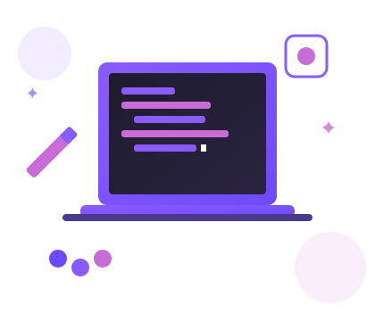

<div align="center">





<br/><br/>

<a href="https://linkedin.com/in/YOUR-LINKEDIN-HANDLE" target="_blank"></a>
<a href="mailto:yadavriya2483@gmail.com"></a>
<a href="https://YOUR-PORTFOLIO-LINK.com" target="_blank"></a>
<a href="tel:+917302280439"></a>

</div>

<br/>


<h2 align="center">✨ About Me</h2>

<table align="center" width="100%">
<tr>
<td width="55%" valign="top">

```yaml
👤 name: "Riya Yadav"
🎯 role: "Front-End Developer & UI/UX Designer"
🎓 education: "MCA @ Devbhoomi Uttarakhand University (2024-2026)"
🔭 currently_working: "UI/UX Designing Intern @ TechnoHacks Solutions"
🌱 learning: ["Advanced React", "Node.js", "Design Systems"]
💬 ask_me_about: ["UI/UX", "Front-End Dev", "Figma"]
⚡ fun_fact: "I turn rough sketches into pixel-perfect interfaces"
```

- 🎓 Pursuing **MCA** — Devbhoomi Uttarakhand University, Dehradun
- 💻 B.Sc. Computer Science — CCS University, Meerut *(CGPA: 7.58)*
- 🧠 Ex **UI/UX Designing Intern** — wireframes, prototypes & hi-fi mockups
- 🎨 Obsessed with clean, responsive, accessible interfaces
- 📫 **yadavriya2483@gmail.com**

</td>
<td width="45%" valign="top" align="center">


</td>
</tr>
</table>


<h2 align="center">🛠️ Tech Arsenal</h2>

<div align="center">


<br/><br/>

<br/>
<br/>
<br/>
<br/>
<br/>
<br/>


</div>

**Core Concepts:** `OOPs` · `DBMS` · `Operating Systems` · `Computer Networks`


<h2 align="center">🚀 Featured Projects</h2>

<table align="center">
<tr>
<td width="50%">

### 🐾 [Puppy's Heavens](YOUR-PROJECT-LINK)
**Pet Healthcare Website**

Responsive platform for pet wellness, vaccination & disease-awareness info — Hero Slider, Doctors section, Node.js contact/help form.


</td>
<td width="50%">

### 🩸 [BloodLink](YOUR-PROJECT-LINK)
**Blood Donation Website**

Donor registration, donor search & emergency blood-donation info, powered by REST APIs.


</td>
</tr>
<tr>
<td width="50%">

### 🛒 [FreshKart](YOUR-PROJECT-LINK)
**Fruits & Vegetables Shopping App**

End-to-end shopping-experience UI/UX crafted entirely in Figma.


</td>
<td width="50%">

### 🏢 [Rao Valuers](YOUR-PROJECT-LINK)
**Business Website Redesign**

Complete redesign focused on modern aesthetics, clarity & usability.


</td>
</tr>
</table>


<h2 align="center">💼 Experience</h2>

<table align="center" width="90%">
<tr><td>

**🎨 UI/UX Designing Intern** — *TechnoHacks Solutions Pvt. Ltd. (Remote)*
`Jan 2026 – Apr 2026`

- Worked on real-world UI/UX projects focused on usability & user engagement
- Designed responsive layouts using **Figma** and **Framer**
- Created wireframes, prototypes, and high-fidelity mockups
- Applied UX principles: accessibility, consistency, visual hierarchy

</td></tr>
</table>


<h2 align="center">🏆 Certifications & Achievements</h2>

<div align="center">

| 🎖️ Certification | 🏛️ Issuer |
|---|---|
| O Level *(IT Tools, Web Design, Python, IoT)* | NIELIT, Government of India |
| UI/UX Strategy | UniAthena (CIQ, UK) |
| Responsive Web Design | freeCodeCamp.org |

</div>


<h2 align="center">📊 GitHub Stats & Activity</h2>

<div align="center">


</div>


<div align="center">

## 🤝 Let's Connect & Build Something Great

<a href="https://linkedin.com/in/YOUR-LINKEDIN-HANDLE"></a>
<a href="mailto:yadavriya2483@gmail.com"></a>
<a href="https://YOUR-PORTFOLIO-LINK.com"></a>

### ⭐ *"Design is intelligence made visible."*

</div>


